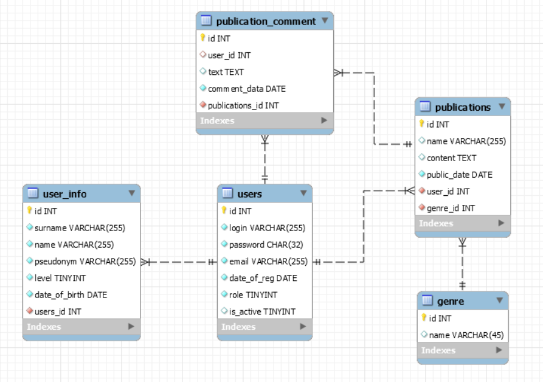

Проект по предмету - ТРиТПО (Технологии разработки и тестирования ПО)
=============
Тема проекта: "Живой журнал" / "Сервис для публикаций"
---------------
Название сайта: "LiveJournal"
---------------
Мокапы: https://drive.google.com/drive/folders/18vZ776Itz2rwFZ9QqfQFnMWUnlyowmoM?usp=sharing
---------------
Видео: https://drive.google.com/drive/folders/1I3ySLn2O5aoJMxT_TRyHcwo_ZxrpgNJu?usp=sharing
---------------
__________________________________________________________________
На данном сайте можно публиковать любого рода текст, который связан с поэзией:
стихи, цитаты, песни, мыслей и т.д.

Роли: **Админ**, **Пользователь**, **Гость**.
  
  **Админ может:** 
  
     • зайти в учетную запись;
     • выйти из нее;
     • просматривать список пользователей;
     • устанавивать флаг активности пользователя.
     
  **Пользователь может:**
  
     • зайти в учетную запись;
     • выйти из нее;
     • создавать публикации;
     • искать публикации;
     • комментировать публикации.
     
  **Гость может:** 
  
     • зарегистрироваться;
     • просматривать публикации;
     • искать публикации;
     
  **Каждому пользователю будет присвоен один из следующих уровеней:**
  
      1. Читатель - тот, кто зарегестрировался, но, еще не создал ни одной публикации;
      2. Новичок - тот, кто создал хотя бы одну публикацию;
      3. Любитель - тот у кого больше, 5 публикаций;
      4. Профи - тот, кто создал больше 15 публикаций;  
      
__________________________________________________________________
  Аналоги: 
  -> https://poembook.ru/id124074  -> https://poems.su/index.php/account/index  -> https://millionstatusov.ru/
__________________________________________________________________

__________________________________________________________________
 База данных:
 
 __________________________________________________________________
 
 __________________________________________________________________
 Web Project
 
    • Приложение реализовать, применяя технологии Servlet и JSP (Servlet container - Apache Tomcat 9.0.40). 
    • Архитектура приложения должна соответствовать шаблонам Layered architecture и MVC. Controller может быть только двух видов: контроллер роли или контроллер приложения. 

Требования к БД 
    
    • Информация о предметной области должна хранится в БД: 
    • Если данные в базе хранятся на кириллице, рекомендуется применять кодировку utf-8 
    • Технология доступа к БД - JDBC 
    • Для работы с БД в приложении должен быть реализован потокобезопасный пул соединений. 
    • При проектировании БД рекомендуется использовать не более 6-8 таблиц 
    • Работу с данными в приложении осуществлять посредством шаблонов DAO или Specification. 

Базовые требования к приложению

    • Интерфейс приложения должен быть локализован; выбор из языков: EN|BE|DE etc. 
    • Приложение должно корректно обрабатывать возникающие исключительные ситуации, в том числе вести их логи. В качестве логгера использовать Log4J2/SLF4J. 
    • Классы и другие сущности приложения должны быть грамотно структурированы по пакетам и иметь отражающую их функциональность название. 
    • При реализации бизнес-логики приложения следует при необходимости использовать шаблоны проектирования (например, шаблоны GoF: Factory Method, Command, Builder, Strategy, State, Observer, Singleton etc). 
    • Для хранения пользовательской информации между запросами использовать сессию. 
    • Для перехвата и корректировки объектов запроса (request) и ответа (response) можно применять фильтры. 
    • При реализации страниц JSP следует использовать теги библиотеки JSTL 
    • При реализации пользовательского интерфейса разрешается использовать любые технологии front-end разработки. 
    • По необходимости можно реализовать собственные теги.  
    • Просмотр “длинных списков” желательно организовывать в постраничном режиме. 
    • Оформление кода должно соответствовать Java Code Convention. 
    • При развертывании приложения разрешается использовать технологию Maven. 

Минимальные требования к функциональности приложения
    
    • Авторизация (sign in) и выход (sign out) в/из системы. 
    • Регистрация пользователя и/или добавление артефакта предметной области системы. 
    • Просмотр информации (например, просмотр всех ставок тотализатора, статистики заказов, счетов и т.д.) 
    • Удаление информации (например, отмена заказа, удаление сущности и т.д.)
    • Добавление и модификация информации (например, создать и отредактировать товар, создать и отредактировать заказ и т.д.)
__________________________________________________________________
